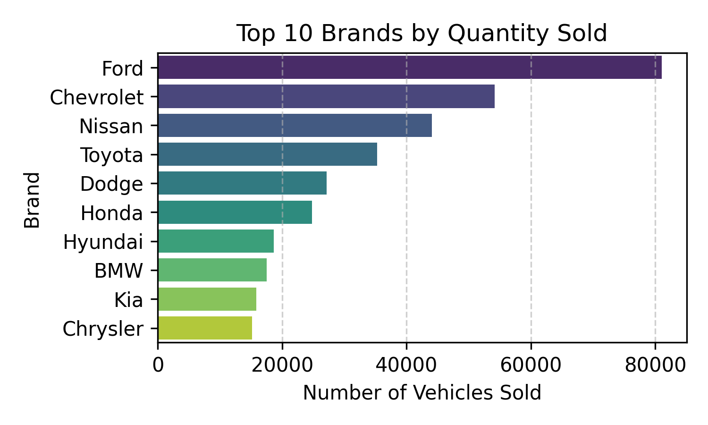

# Vehicle-Car-Sales
Vehicle/Car Sales Trends and Pricing Insights

Analysis of Vehicle Sales in USA 2014-2015 Kaggle dataset
[link](https://www.kaggle.com/datasets/syedanwarafridi/vehicle-sales-data)

Sales from January 2014 till December 2014 are missing, and there is no data on sales in April 2015.
So it won't be possible to make a forecast model here.
We can only find out which vehicle's characteristics are more popular with buyers.

