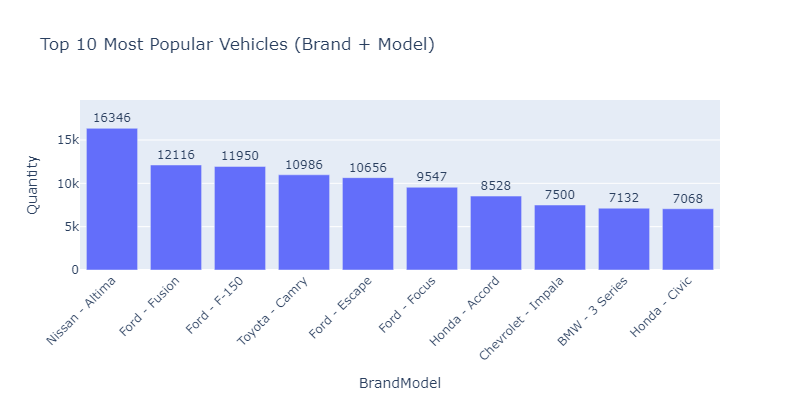

# 🚗 Vehicle-Car-Sales: Trends and Pricing Insights

**Exploratory Data Analysis of U.S. Vehicle Sales (2014–2015)**  
Dataset: [Vehicle Sales Data on Kaggle](https://www.kaggle.com/datasets/syedanwarafridi/vehicle-sales-data)

---

## 📊 Overview

This project analyzes U.S. vehicle sales data from 2014 to 2015 to uncover trends in sales volume, revenue, and pricing across different brands and models. Due to missing data for January–December 2014 and April 2015, time series forecasting isn't feasible. Instead, the focus is on identifying patterns in buyer preferences and vehicle characteristics.

---

## 📈 Key Visualizations & Insights

### 1. Monthly Sales Volume

- **Observation**: Sales data is incomplete for 2014 and missing for April 2015, limiting temporal analysis.
- **Insight**: Despite data gaps, a general upward trend in sales is noticeable, indicating growing market activity.

---

### 2. Top 10 Brands by Total Revenue and Quantity Sold

- **Observation**: Brands like Ford and Chevrolet dominate in total sales revenue and lead in quantity sold.
- **Insight**: High revenue correlates with a combination of unit sales, suggesting a focus on affordable models.

---

### 3. Top 10 Vehicle Models by Quantity Sold and Revenue

- **Observation**: Models like the Nissan Altima and Ford Fusion are most popular by sold quantity and revenue.
- **Insight**: These models balance affordability and reliability, appealing to a broad customer base.

---

### 4. Most selled model by most popular brands 

- **Observation**: Ford models occupy the largest segment of customers market, Chevrolet and Nissan models are 2nd popular, and then BMV and Toyota models are 3thd.

---

### 5. Vehicle Selling Price vs. Manufacturing Year

- **Observation**: Newer vehicles tend to have higher selling prices.
- **Insight**: Depreciation is evident, with vehicle value decreasing as the manufacturing year becomes older.

---

## 📌 Conclusion

- **Data Limitations**: Missing data for significant periods restricts comprehensive temporal analysis and forecasting.
- **Brand Performance**: Brands like Ford, Chevrolet, Nissan, Toyota, BMV lead in revenue and quantity sold.
- **Model Preferences**: Affordable and reliable models dominate in the market.
- **Depreciation Trends**: Vehicle value depreciates over time, influencing buyer decisions and revenue patterns.

